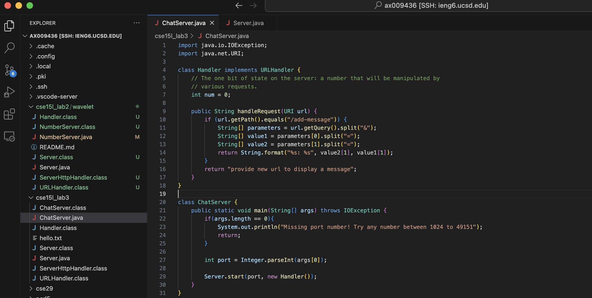
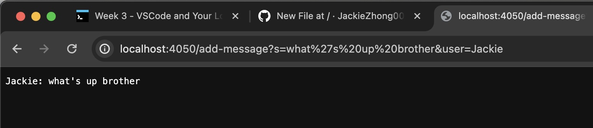
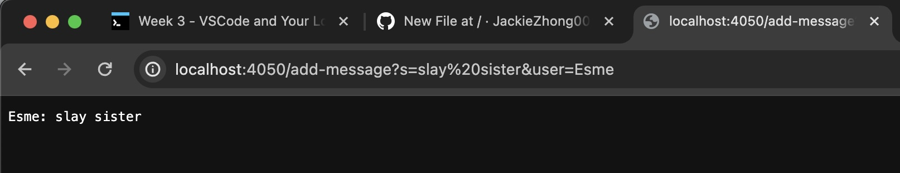
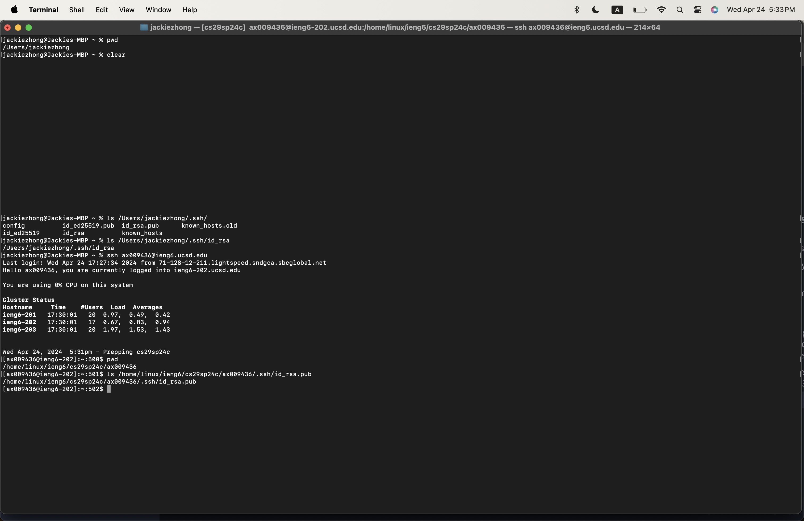

#CSE15L Lab Report 2

##Part 1

1. The handleRequest method of the Handler class was called. Within the handleRequest method, the getPath() method was called to get the path portion of the uri as a string, .equals()
was called to compare the value of the hard coded string "add-message" to the string value representing the path of the uri, .split() was called to separate the strings based on a specific 
character and to place those string fragments into an array, and .getQuery() method was called to get the query parameters of the uri. The String.format() method was called to return 
a string that incorporates string values from an array. 
2. Relevant arguments to the handleRequest method is a URI. The .getPath() and .getQuery() method doesn't take any arguments and instead, it's a built in URI datatype method. 
The .equals() method takes in a string argument that is used to compare with the string formatted output of .getPath(). The .split() method takes in a string argument that represents the substring
used to split the string with. The substring's index is the exact location of the split and the split method's array output omits the substring. The String.format() method's relevant arguments
include a string literal that outlines how variable and non-string-literal values can be nested into the string for output.
3. No values of the class were changed because all we need to do is to extract strings from the query parameter, which we're able to do directly. 

1. The handleRequest method of the Handler class was called. Within the handleRequest method, the getPath() method was called to get the path portion of the uri as a string, .equals()
was called to compare the value of the hard coded string "add-message" to the string value representing the path of the uri, .split() was called to separate the strings based on a specific 
character and to place those string fragments into an array, and .getQuery() method was called to get the query parameters of the uri. The String.format() method was called to return 
a string that incorporates string values from an array.
2. Relevant arguments to the handleRequest method is a URI. The .getPath() and .getQuery() method doesn't take any arguments and instead, it's a built in URI datatype method. 
The .equals() method takes in a string argument that is used to compare with the string formatted output of .getPath(). The .split() method takes in a string argument that represents the substring
used to split the string with. The substring's index is the exact location of the split and the split method's array output omits the substring. The String.format() method's relevant arguments
include a string literal that outlines how variable and non-string-literal values can be nested into the string for output.
3. No values of the class were changed because all we need to do is to extract strings from the query parameter, which we're able to do directly. 

##Part 2

##Part 3
I learned in week 2 how url requests are parsed and handled by servers and how SSH keys is used to authorize users for secure communication between servers.
I've never understood how private and public SSH keys work together and have always thought of SSH keys as a general password-like authorization. 
